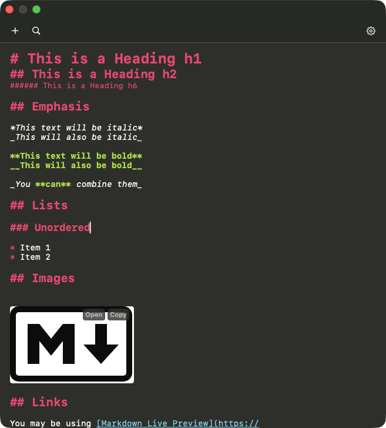

# AwesomeQuickNote

A macOS menu bar note-taking app that floats on top of everything. Like SideNote or Raycast Notes, except this one is free, supports images, and was written by someone who can't write Swift.



## Why does this exist?

I wanted a simple floating note app for macOS. SideNote costs money. Raycast Notes doesn't support images. So I did what any reasonable developer would do: I mass-prompted an AI until a working app came out the other end.

**I cannot write Swift.** Not a single line. This entire app is 100% vibe-coded. Every function, every view, every `@Observable` — all vibes. The AI wrote it, I clicked build, and somehow it works.

## Features

- **Floating panel** — Always on top, across all spaces, doesn't steal focus
- **Markdown editing** — With syntax highlighting (Monokai theme, obviously)
- **Markdown preview** — Toggle between edit and rendered view
- **Image support** — Paste or drag images directly into notes (saved as attachments)
- **Fuzzy search** — Find notes by title or content instantly
- **Pin notes** — Keep important notes at the top
- **Find & replace** — Cmd+F / Cmd+H in the editor
- **Auto-save** — Notes save as you type (500ms debounce)
- **Plain .md files** — Your notes are just markdown files in a folder you choose
- **Checkbox support** — Click to toggle `[ ]` and `[x]` in the editor
- **Auto list continuation** — Press Enter on a list item and the next bullet appears
- **Adjustable opacity** — Make the panel semi-transparent (30%–100%)
- **Panel positioning** — Snap to 9 screen positions or drag wherever you want
- **Customizable shortcuts** — Remap all hotkeys in settings
- **Customizable font** — Pick any monospaced font, adjust size 10–28pt
- **Local first** — No accounts, no cloud, no telemetry. Just files on your disk
- **Native & fast** — Pure SwiftUI + AppKit. No Electron. No web views

## Keyboard Shortcuts

| Shortcut | Action |
|---|---|
| Cmd+Shift+N | Toggle panel |
| Cmd+Option+N | New note |
| Cmd+Shift+F | Search notes |
| Cmd+Option+P | Toggle pin |
| Cmd+Shift+R | Reset panel position |
| Cmd+F | Find in editor |
| Cmd+H | Find & replace |
| Esc | Close overlays |

All shortcuts are customizable in Settings.

## Install

Download the latest `.dmg` from [Releases](../../releases), open it, drag the app to `/Applications`, then remove the quarantine flag because the app is not code-signed (I'm not paying Apple $99/year for a vibe-coded app):

```bash
xattr -cr /Applications/AwesomeQuickNote.app
```

## Build from source

```bash
swift build
```

Requires macOS 14.0+.

## Maintenance Policy

There is no maintenance policy. I built this for myself and it does what I need.

If you want a new feature, fork it and vibe-code it yourself. That's how this was made and that's how it should continue. The circle of vibe must not be broken.

## Tech Stack

- Swift 5.10 / SwiftUI + AppKit
- [KeyboardShortcuts](https://github.com/sindresorhus/KeyboardShortcuts) — Global hotkeys
- [MarkdownUI](https://github.com/gonzalezreal/swift-markdown-ui) — Markdown rendering
- [Fuse](https://github.com/krisk/fuse-swift) — Fuzzy search

## License

Do whatever you want with it. I mass-prompted it into existence and I'm not going to pretend I own the intellectual property of an AI-human typing relay.

---

*Yes, even this README was vibe-coded. It's vibes all the way down.*
